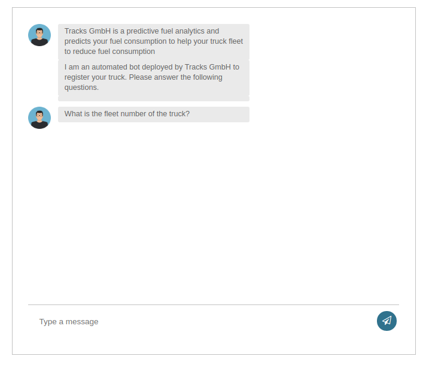

# Traks GmbH chatbot

The chatbot Django application is designed to collect trucks specific information from the customer. The bot store all the chats in a trucks.csv file for further analysis.

## How to run the application

we need the following steps to run the application:

1. clone the `git` repository to your computer.

2. change directory to the `chatbot` directory.

3. create a virtual environment with python3 `python3 -m venv env` and activate the environment with `source env/bin/activate`

4. install the required dependency with the command `pip install -r requirements`.

5. After successfully installation of the requirements run the app with `python tracksCustomers/manage.py runserver`

6. Open your browser and go to url `http://localhost:8000/chatbot/` if the chat work successfully you will see the following screen.

7. The bot will ask a series of questions and you need to provide the correct answers. if you try to give a wrong answer the bot will reject and give you the reason.

## File Structure

* [tracksCustomers/](./chatbot/tracksCustomers)
  * [chatbot/](./chatbot/tracksCustomers/chatbot)
    * [__pycache__/](./chatbot/tracksCustomers/chatbot/__pycache__)
    * [migrations/](./chatbot/tracksCustomers/chatbot/migrations)
    * [static/](./chatbot/tracksCustomers/chatbot/static)
    * [templates/](./chatbot/tracksCustomers/chatbot/templates)
    * [__init__.py](./chatbot/tracksCustomers/chatbot/__init__.py)
    * [admin.py](./chatbot/tracksCustomers/chatbot/admin.py)
    * [apps.py](./chatbot/tracksCustomers/chatbot/apps.py)
    * [file_handler.py](./chatbot/tracksCustomers/chatbot/file_handler.py)
    * [models.py](./chatbot/tracksCustomers/chatbot/models.py)
    * [tests.py](./chatbot/tracksCustomers/chatbot/tests.py)
    * [trucks_spec.json](./chatbot/tracksCustomers/chatbot/trucks_spec.json)
    * [urls.py](./chatbot/tracksCustomers/chatbot/urls.py)
    * [validate_truck.py](./chatbot/tracksCustomers/chatbot/validate_truck.py)
    * [views.py](./chatbot/tracksCustomers/chatbot/views.py)
  * [tracksCustomers/](./chatbot/tracksCustomers/tracksCustomers)
    * [__pycache__/](./chatbot/tracksCustomers/tracksCustomers/__pycache__)
    * [__init__.py](./chatbot/tracksCustomers/tracksCustomers/__init__.py)
    * [settings.py](./chatbot/tracksCustomers/tracksCustomers/settings.py)
    * [urls.py](./chatbot/tracksCustomers/tracksCustomers/urls.py)
    * [wsgi.py](./chatbot/tracksCustomers/tracksCustomers/wsgi.py)
  * [db.sqlite3](./chatbot/tracksCustomers/db.sqlite3)
  * [manage.py](./chatbot/tracksCustomers/manage.py)
* [.gitignore](./chatbot/.gitignore)
* [README.md](./chatbot/README.md)
* [chatbot.png](./chatbot/chatbot.png)
* [requirements.txt](./chatbot/requirements.txt)
* [sentence_tokenizer.pickle](./chatbot/sentence_tokenizer.pickle)
* [trucks_spec.json](./chatbot/trucks_spec.json)
* [truks.csv](./chatbot/truks.csv)

## Modification

* if you want to add more brands and models please edit the `trucks_spec.json`.

* If you need the stored conversiation of the customer check the `trucks.csv` file in the root directory.